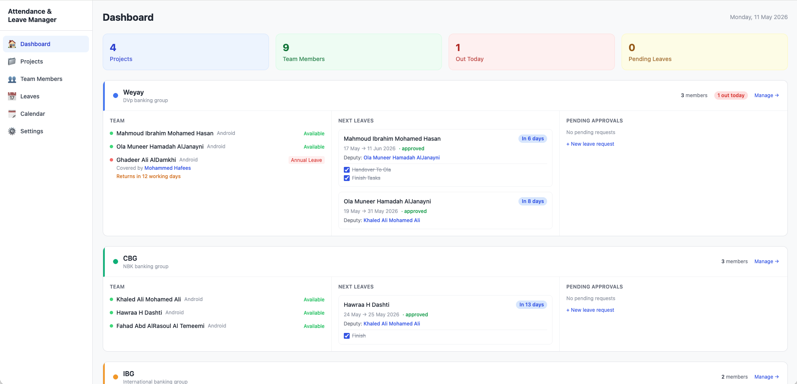
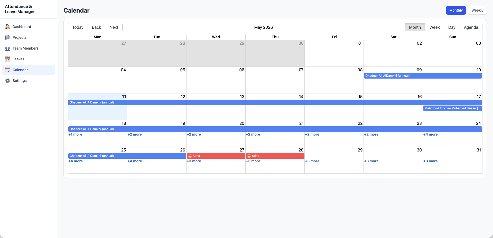
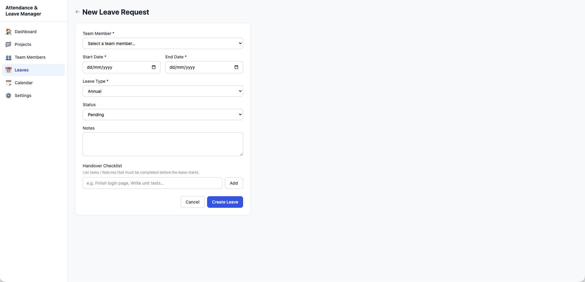

# Attendance Management App

A full-stack app to manage project teams, annual leave, attendance availability, deputies, and handover tasks.

## Features

- Project-based team management
- Resource/member allocation across multiple projects
- Leave request workflow (pending, approved, rejected)
- Deputy assignment during leave
- Handover checklist per leave request
- Dashboard with:
  - nearest upcoming leave per member
  - countdown to leave start
  - return countdown for members currently on leave
  - task completion toggles for handover items
- Calendar view for leave visibility
- Settings for leave types and public holidays

## Tech Stack

- Frontend: React + TypeScript + Vite + TailwindCSS
- Backend: Node.js + Express
- Database: SQLite (better-sqlite3)
- Containerization: Docker + Docker Compose

## Project Structure

- `src/` - Frontend app
- `server/` - Express API + SQLite access
- `docker-compose.yml` - Backend container setup

## Prerequisites

- Node.js 20+
- npm 10+
- Docker Desktop (for containerized backend)

## Quick Start (Local)

Install frontend dependencies:

```bash
npm install
```

Install backend dependencies:

```bash
cd server
npm install
cd ..
```

Run backend locally:

```bash
cd server
npm run dev
```

Run frontend locally (in another terminal):

```bash
npm run dev
```

Frontend runs on `http://localhost:5173` and proxies `/api` to backend on `http://localhost:3001`.

## Run Backend with Docker

Build and start backend container:

```bash
docker compose up --build -d
```

Check health:

```bash
curl http://localhost:3001/api/health
```

Expected response:

```json
{"ok":true}
```

Stop container:

```bash
docker compose down
```

## Data and Persistence

- SQLite database is stored in Docker volume `sqlite_data` at `/data/attendance.db`.
- Backend includes a migration guard for new columns like `handover_items`.
- Frontend seeds sample data on app start via `/api/seed` (only once).

## Screenshots

Add product screenshots under `docs/screenshots/` and update the image links below.





## API Endpoints

Base URL: `http://localhost:3001/api`

| Method | Endpoint | Description |
|---|---|---|
| GET | `/health` | Health check |
| GET | `/projects` | List all projects |
| POST | `/projects` | Create a project |
| PUT | `/projects/:id` | Update a project |
| DELETE | `/projects/:id` | Delete a project |
| GET | `/resources` | List all resources/members |
| POST | `/resources` | Create a resource/member |
| PUT | `/resources/:id` | Update a resource/member |
| DELETE | `/resources/:id` | Delete a resource/member |
| GET | `/leaves` | List all leaves |
| POST | `/leaves` | Create a leave |
| PUT | `/leaves/:id` | Update a leave |
| DELETE | `/leaves/:id` | Delete a leave |
| GET | `/settings` | Get app settings |
| PUT | `/settings` | Save app settings |
| POST | `/seed` | Seed sample data (first run only) |

### Example Leave Payload

```json
{
  "resourceId": "r_123",
  "type": "annual",
  "startDate": "2026-05-20",
  "endDate": "2026-05-23",
  "status": "pending",
  "deputyId": "r_456",
  "notes": "Vacation",
  "handoverItems": [
    { "id": "h1", "text": "Finish release notes", "done": false },
    { "id": "h2", "text": "Handover API docs", "done": true }
  ]
}
```

## Available Scripts

Frontend (`/`):

- `npm run dev` - Start Vite dev server
- `npm run build` - Build frontend for production
- `npm run preview` - Preview production build

Backend (`/server`):

- `npm run dev` - Start API server with Node

## Common Troubleshooting

1. `error: src refspec main does not match any`
- Ensure your current branch exists locally.
- If needed: `git branch -m main && git push -u origin main`

2. Docker daemon not running
- Start Docker Desktop and retry `docker compose up --build -d`

3. npm registry/auth issues
- This project uses `.npmrc` with `https://registry.npmjs.org/`

## Roadmap Ideas

- Capacity planning per platform (Android/iOS/MAS)
- Conflict detection for overlapping critical leave
- Multi-level leave approvals
- Notifications/reminders for incomplete handovers
